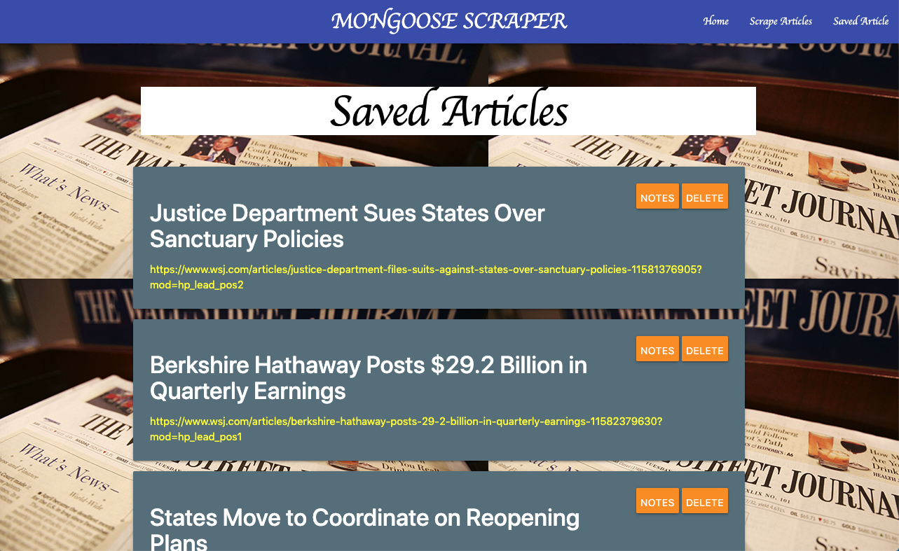
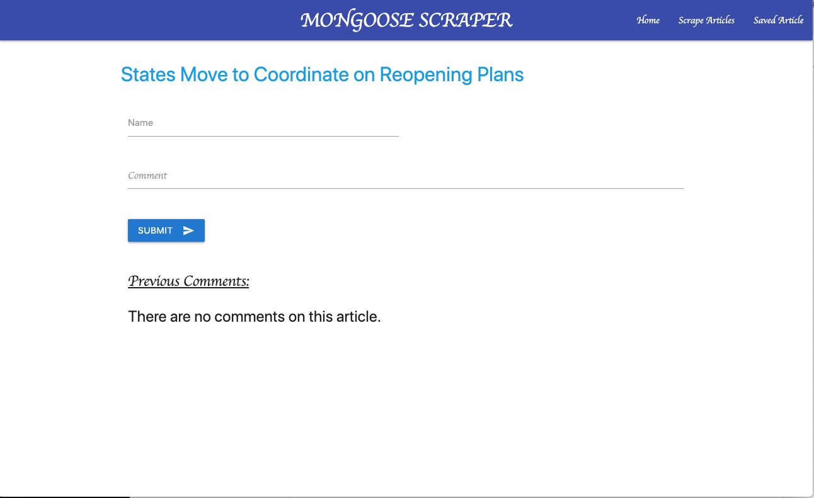

# Mongoose-Scrape #

This full-stack application allows a client to scrape headlines, links, and (if available) excerpts from the Wall Street 
Journal website. The client can then save the articles in a database, delete saved articles, make notes on specific articles, and delete those notes.

This app is deployed at:  https://enigmatic-taiga-78651.herokuapp.com/

## Scraping ##

The application uses "request" and "cheerio" for scraping the Wall Street HTML. The articles scraped are compared to the ones in the database, and if the articles hasn't already been stored, it is put into an object which is rendered on the "/scrape" route with the help of the "express-handlebars" npm package. Both the scrape page and the Saved Articles page display links to the associated articles so that the user may check out the full articles before saving or writing a comment.

## Saved Articles ##

The articles are saved to the database with the help of the Mongoose NPM. According to their page, "Mongoose is a MongoDB object modeling tool designed to work in an asynchronous environment." This application uses Article and Note models with the Article model containing an array "note" that stores the ObjectIds of any associated Note. From the Saved Articles page, the client can delete an article from the database or navigate to the article's Note/Comment page in order to see any associated notes/comments or to make a comment. The data on all routes is redered with "express-handlebars".

