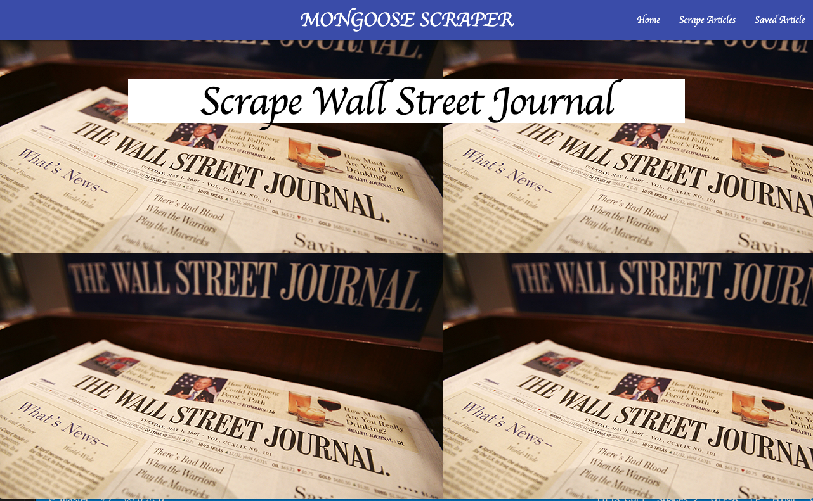
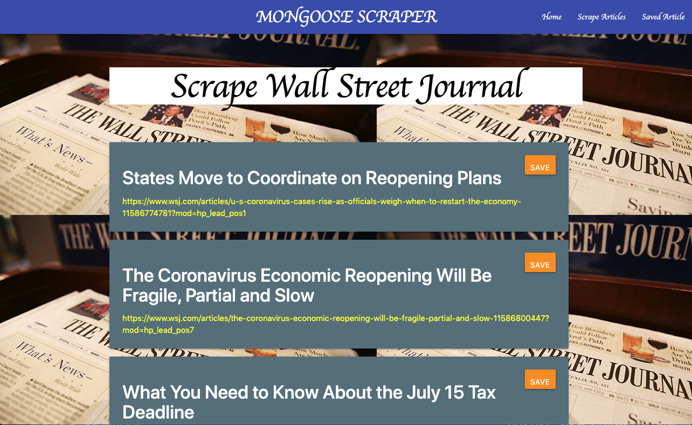

# Mongoose-Scrape #

This full-stack application allows a client to scrape headlines, links, and (if available) excerpts from the Wall Street 
Journal website. The client can then save the articles in a database, delete saved articles, make notes on specific articles, and delete those notes.

This app is deployed at:  https://enigmatic-taiga-78651.herokuapp.com/

## Scraping ##

The application uses "axios" and "cheerio" for scraping the Wall Street Journal HTML. The articles scraped are compared to the ones in the mongoose database, and if the articles hasn't already been stored, it is put into an object which is rendered on the "/scrape" route with the help of the "express-handlebars" npm package. 

